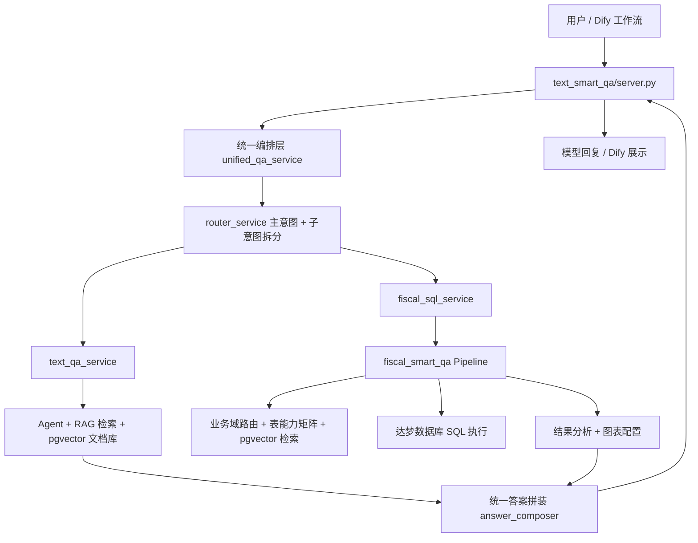
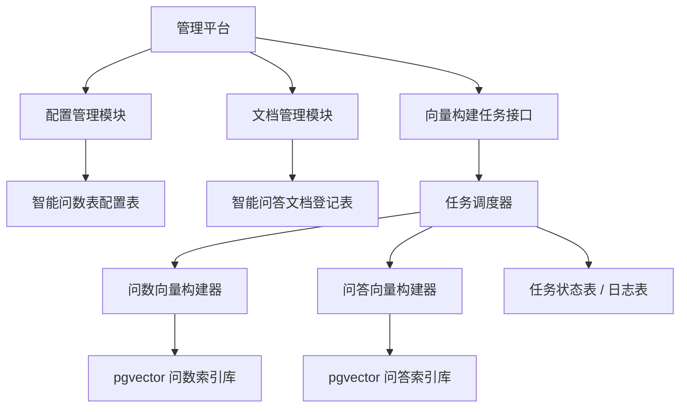

# dataQuery 技术架构设计文档

## 1. 文档目的

本文档用于说明 `dataQuery` 项目当前代码实现对应的整体技术架构，并在现有智能问答 `text_smart_qa` 与智能问数 `fiscal_smart_qa` 功能基础上，补充统一入口、主意图与子意图拆分、动态向量库生成、管理平台和扩展接口的设计方案。

本文档重点回答以下问题：

1. 当前项目是如何从“用户输入问题”走到“模型生成回复”的。
2. 智能问答、智能问数分别由哪些模块组成，每个模块为什么这样设计，解决什么业务问题。
3. 如何在现有工程上支持“智能问答和智能问数向量库动态生成”。
4. 如何通过一个管理平台完成表配置、文档上传、文档删除、向量库自动更新。


## 2. 现状总体架构

### 2.1 当前项目结构

`dataQuery` 当前主要由两个核心子项目组成：

1. `text_smart_qa`
   负责财政文档智能问答，底层采用 RAG 检索增强生成。

2. `fiscal_smart_qa`
   负责自然语言转 SQL 的财政智能问数，底层依赖达梦数据库、元数据、表能力矩阵和 pgvector 向量检索。

目前两个能力已经通过 `text_smart_qa/server.py` 统一对外提供服务入口。


### 2.2 当前统一入口架构

当前统一入口在：

- `D:\pythonPro\dataQuery\text_smart_qa\server.py`

它承担 3 个职责：

1. 提供 OpenAI 兼容的 `/v1/chat/completions` 接口，兼容 Dify 工作流入口。
2. 调用统一编排层 `src/unified/unified_qa_service.py`，完成智能问答、智能问数、混合问答和闲聊的路由与执行。
3. 提供 `/v1/chart/export` 接口，将智能问数缓存的图表配置导出成 ECharts option，供 Dify 页面展示。


### 2.3 当前总体逻辑图




## 3. 现状模块设计说明

---

## 3.1 统一接入层

### 对应代码

- `D:\pythonPro\dataQuery\text_smart_qa\server.py`

### 设计原因

原来智能问答和智能问数是两个相对独立的功能块。为了兼容 Dify 工作流，并满足“项目只有一个入口”的需求，需要把两个能力收敛到统一网关。

### 解决的业务问题

1. 对外只暴露一个接口地址，便于接入。
2. 支持 Dify 以 OpenAI 兼容协议调用。
3. 把会话上下文、地区码、流式输出、图表导出都统一在一层处理。

### 关键处理点

1. 解析 `messages`。
2. 提取地区码 `region_code`。
3. 调用统一编排服务。
4. 返回统一 JSON。
5. 如果是智能问数且有图表，支持通过 `/v1/chart/export` 获取 ECharts option。


---

## 3.2 统一编排层

### 对应代码

- `D:\pythonPro\dataQuery\text_smart_qa\src\unified\unified_qa_service.py`
- `D:\pythonPro\dataQuery\text_smart_qa\src\unified\models.py`
- `D:\pythonPro\dataQuery\text_smart_qa\src\unified\answer_composer.py`

### 设计原因

智能问答和智能问数的技术链路完全不同：

1. 智能问答依赖文档向量检索和大模型生成。
2. 智能问数依赖意图识别、选表、编译 SQL、数据库执行和结果分析。

如果直接在入口层写大量 `if else`，后续很难维护。因此设计统一编排层，把路由、调用和答案整合从 FastAPI 控制器中剥离出来。

### 解决的业务问题

1. 支持一个问题同时包含“问数”和“问答”。
2. 支持主意图和子意图拆分。
3. 统一输出格式，方便前端和 Dify 处理。

### 当前实现思路

统一编排层当前采用：

1. 先识别主意图。
2. 再拆分子意图。
3. 对每个子意图选择 `text_qa` 或 `fiscal_sql`。
4. 如果是混合问题，则按“先问数、再问答”的顺序整合答案。


---

## 3.3 路由层

### 对应代码

- `D:\pythonPro\dataQuery\text_smart_qa\src\unified\router_service.py`

### 设计原因

财政厅场景里，用户问题经常不是单一问题，而是复合问题，例如：

- `2019年全省一般公共预算收入总计多少，由哪几部分构成`

前半句是问数，后半句是问答。如果整句只分一次类，容易误判。

因此当前代码已经按“主意图 + 子意图拆分”实现：

1. 先拆句。
2. 对每个子句独立分类。
3. 最后汇总主意图。

### 解决的业务问题

1. 解决“一个问题里同时包含问数和问答”的场景。
2. 解决“问数条件不充分时误走智能问数”的问题。
3. 为后续多子问题并行执行留好扩展点。

### 当前关键规则

1. 通过关键词和结构规则先做粗分。
2. 只有同时提取到明确的：
   - 科目
   - 指标
   - 收支方向
   - 地区层级

   才允许进入智能问数。

3. 如果关键要素不完整，则统一走智能问答。
4. 如果规则无法确定，再用大模型做兜底判断。

### 为什么这样设计

财政问数不是“像数据问题就能查”，而是必须要具备足够明确的业务语义，否则 SQL 链路会误查、空查或者错表。

### 3.3.1 业务路由模块详细设计

当前业务路由模块不再只是简单的“问答/问数二选一”，而是一个分层判断模块，核心目标是让系统先判断“用户想做什么”，再判断“当前条件是否足以执行”，最后才决定走哪条链路。其设计重点如下：

1. 路由输入
   - 输入来自 `text_smart_qa/src/unified/unified_qa_service.py`
   - 当前轮用户问题会先做标准化处理，去掉多余空格，再进入 `router_service.py`
   - 如果是多轮会话，路由器还可以接收最近几轮历史消息，供大模型补判时参考

2. 主意图判断
   - 路由结果分为 `text_qa`、`fiscal_sql`、`hybrid`、`chitchat` 四类
   - `text_qa` 表示偏政策解释、文件依据、口径说明
   - `fiscal_sql` 表示偏财政数据查询
   - `hybrid` 表示同一个问题里同时存在问数和问答
   - `chitchat` 表示闲聊或无关问题

3. 子意图拆分
   - `router_service.py` 会先按逗号、分号、并且、以及、同时等连接词对复合问题拆句
   - 每个子句独立做分类，而不是整句一次性分类
   - 这样可以处理“前半句查数、后半句解释”的场景，例如：`2019年全省一般公共预算收入总计多少，由哪几部分构成`

4. 业务域前缀锚点
   - 当前代码已经支持把 `预算执行业务域中`、`决算业务域中`、`预算调整业务域中`、`预算草案业务域中`、`预算审查业务域中` 识别为“业务域锚点”
   - 这类前缀不会再被当成独立子问题，而是作为上下文补到后续真正的查询问题前面
   - 这样可以避免“业务域说明语句”单独参与路由竞争，导致整句误判成补槽位或问答

5. 问数候选态判断
   - 对于疑似问数问题，路由模块不会立即放行到 SQL
   - 代码会先抽取四个关键槽位：
     - 科目
     - 指标
     - 收支方向
     - 地区层级
   - 只有四项都明确时，子任务才会标记为 `slot_status=ready`
   - 如果问题明显是问数意图，但关键槽位不完整，则会进入 `slot_status=clarify`

6. 缺槽位补问机制
   - 当子任务处于 `clarify` 状态时，路由层不会直接降级为问答，也不会继续执行 SQL
   - 系统会返回缺失槽位列表 `missing_slots`，同时构造 `clarify_message`
   - `clarify_message` 会告诉用户当前已经识别到哪些条件，还缺少哪些条件，并给出一条推荐提问示例
   - 这样做的好处是：用户体验比“查询失败”更好，也能避免错误 SQL 落库执行

7. 科目识别来源
   - 当前 `_subject_keywords` 不再写死，而是优先从 `fiscal_smart_qa/projectname.json` 中动态加载
   - `projectname.json` 来自达梦收支表项目名称抽取结果，因此路由层能够复用问数向量库构建时沉淀出的真实财政项目名称
   - 这意味着路由层与问数底层的业务口径保持一致，减少“路由认为是明确科目，但底层查不到”的情况

8. 规则优先，大模型兜底
   - 当前路由实现遵循“规则优先，大模型兜底”
   - 优先使用关键词、槽位、结构规则做高可控判断
   - 只有规则无法确定时，才调用大模型输出结构化 JSON 补判
   - 这样可以降低模型波动带来的路由不稳定问题

9. 路由输出结构
   - 当前路由输出不是简单字符串，而是 `RoutingDecision`
   - 其中包含：
     - 主路由类型 `route`
     - 主意图 `main_intent`
     - 子任务列表 `sub_tasks`
     - 槽位状态 `slot_status`
     - 缺失槽位 `missing_slots`
     - 已识别槽位值 `slot_values`
     - 补槽位提示 `clarify_message`
   - 这一结构为后续统一编排层、前端页面和 Dify 工作流提供了稳定的数据基础

10. 模块解决的核心问题
   - 解决“一个问题包含多种意图”的识别问题
   - 解决“业务域说明语句干扰真正查询语句”的问题
   - 解决“看起来像问数，但槽位不够仍然误查库”的问题
   - 解决“路由层和问数底层科目口径不一致”的问题


---

## 3.4 智能问答模块

### 对应代码

- `D:\pythonPro\dataQuery\text_smart_qa\src\unified\text_qa_service.py`
- `D:\pythonPro\dataQuery\text_smart_qa\src\agent\my_agent1.py`
- `D:\pythonPro\dataQuery\text_smart_qa\src\agent\db\ingest_data_postgres.py`
- `D:\pythonPro\dataQuery\text_smart_qa\src\agent\db\pgvector_store.py`

### 设计原因

财政厅文档问答本质上是基于政策解读、预算报告、人大法规、会议讲话等文档的检索增强生成，不适合直接靠大模型“记忆回答”。

### 解决的业务问题

1. 回答政策依据、文件内容、预算解读、构成说明、名词解释。
2. 支持地区维度过滤。
3. 支持图文混合文档检索。

### 当前实现流程

1. 文档入库脚本 `ingest_data_postgres.py`
   - 扫描 `text_smart_qa/data` 下的 `.docx` 和 `.txt`
   - 按 `***` 和 `<--split-->` 切分父块和子块
   - 提取图片并保存到 `static/images`
   - 为每个切片生成 metadata
   - 使用 `PgVectorStore` 写入 PostgreSQL pgvector

2. 在线问答时
   - `TextQaService` 调用 Agent
   - Agent 强制通过 RAG 工具检索知识库
   - 大模型基于检索结果生成最终答案

### 为什么这样设计

1. 文档结构复杂，既有正文也有图片，必须预处理。
2. 通过父子切片和 `recall_context` 可以平衡召回精度与上下文完整性。
3. 通过 pgvector 替代原有 Vastbase floatvector，更利于统一技术栈。


---

## 3.5 智能问数模块

### 对应代码

- `D:\pythonPro\dataQuery\fiscal_smart_qa\qa_pipeline.py`
- `D:\pythonPro\dataQuery\fiscal_smart_qa\intent.py`
- `D:\pythonPro\dataQuery\fiscal_smart_qa\entity_resolver.py`
- `D:\pythonPro\dataQuery\fiscal_smart_qa\query_compiler.py`
- `D:\pythonPro\dataQuery\fiscal_smart_qa\dameng_executor.py`
- `D:\pythonPro\dataQuery\fiscal_smart_qa\result_analyzer.py`
- `D:\pythonPro\dataQuery\fiscal_smart_qa\charting.py`

### 设计原因

财政厅的问数场景不是简单的 text-to-sql，而是“强业务约束”的问数：

1. 有四本账口径。
2. 有业务域。
3. 有收支方向。
4. 有地区层级。
5. 后续表规模会从 10 张扩展到 80 张以上。

### 解决的业务问题

1. 从自然语言中识别年份、地区、科目、指标、口径。
2. 在大量财政表中选出正确候选表。
3. 生成可执行 SQL。
4. 返回分析摘要、明细数据和图表配置。

### 当前实现流程

1. `intent.py`
   - 使用大模型和规则解析 QueryPlan。
   - 提取业务模块、四本账、收支方向、指标、时间范围等信息。

2. `domain_router.py`
   - 第一层做业务域路由，不让所有表直接竞争。

3. `metadata.py` + `table_capability.py`
   - 第二层根据表能力矩阵过滤候选表。
   - 这是当前“先过滤、再向量召回”的核心实现。

4. `vector_retriever.py`
   - 在 pgvector 中检索：
     - 表画像向量
     - 指标别名向量
     - 科目绑定向量

5. `entity_resolver.py`
   - 综合业务域、表能力矩阵、向量召回结果，选择最合适的表和字段。

6. `query_compiler.py`
   - 把解析结果编译成 SQL。

7. `dameng_executor.py`
   - 连接达梦数据库执行 SQL。

8. `result_analyzer.py`
   - 生成摘要分析。

9. `charting.py`
   - 生成图表原始配置。

### 为什么这样设计

1. 业务域路由解决后续多表扩容问题。
2. 表能力矩阵减少错误表参与竞争。
3. 向量检索提升科目、指标、表描述的语义匹配能力。
4. SQL 编译与执行拆开，方便问题排查和审计。

### 3.5.1 QueryPlan 生成模块详细设计

`QueryPlan` 是智能问数模块里最核心的中间结构，它的作用是把“自然语言问题”转换成“后续可被路由、选表、编 SQL、执行 SQL 使用的结构化查询计划”。当前实现对应：

- `D:\pythonPro\dataQuery\fiscal_smart_qa\intent.py`
- `D:\pythonPro\dataQuery\fiscal_smart_qa\query_plan.py`

#### 一、为什么必须先生成 QueryPlan

财政问数并不是一句话直接交给大模型生成 SQL 就可以结束。真正执行 SQL 前，系统还需要依次回答以下问题：

1. 这句话问的是趋势、占比、比较还是明细？
2. 问题属于哪个业务域，例如预算执行、预算草案、预算调整、决算？
3. 四本账口径是什么？
4. 收入还是支出？
5. 查询哪个科目、哪个指标、哪个地区、哪个时间范围？
6. 是否具备进入 SQL 链路的最小条件？

这些问题都必须在 `QueryPlan` 阶段先被结构化，否则后面的选表和编 SQL 都没有稳定输入。

#### 二、当前 QueryPlan 的主要字段

当前 `query_plan.py` 中定义的 `QueryPlan` 主要包含以下字段：

1. 基础查询字段
   - `raw_question`
   - `query_type`
   - `time_text`
   - `start_yyyymm`
   - `end_yyyymm`

2. 财政语义字段
   - `budget_scope`
   - `subjects`
   - `metrics`
   - `regions`

3. 分析和展示字段
   - `compare_dimension`
   - `compare_operator`
   - `chart_hint`
   - `top_n`

4. 业务域路由字段
   - `business_module`
   - `account_book`
   - `flow_type`
   - `region_level`
   - `data_stage`
   - `time_grain`

5. 执行前校验辅助字段
   - 通过 `validate_query_plan(...)` 生成 `SlotValidationResult`
   - 判断是否满足进入 SQL 的最小条件

#### 三、QueryPlan 的生成流程

当前 `intent.py` 里的 `build_query_plan(...)` 实现采用“两阶段解析”：

1. 第一阶段：大模型结构化抽取
   - 通过 `INTENT_PROMPT` 要求大模型直接输出 JSON
   - 提取 `query_type`、时间范围、预算口径、科目、指标、地区、业务域、四本账、收支方向等字段
   - 这一步的优点是覆盖面广，适合处理复杂自然语言表达

2. 第二阶段：规则补全与纠偏
   - 对大模型没有提到、提错、提成 `unknown` 的字段，用本地规则补齐
   - 例如：
     - `_extract_business_module(...)`
     - `_extract_account_book(...)`
     - `_extract_flow_type(...)`
     - `_extract_region_level(...)`
     - `_extract_time_grain(...)`
   - 这样可以提高关键财政字段的稳定性，避免完全依赖模型输出

3. 最终生成 `QueryPlan`
   - 所有字段整合后，输出一个统一结构对象
   - 后续 `qa_pipeline.py`、`entity_resolver.py`、`query_compiler.py` 只读取 `QueryPlan`，不再直接面对原始自然语言

#### 四、QueryPlan 的兜底策略

如果大模型抽取失败，当前代码会自动进入 `fallback_query_plan(...)` 规则兜底流程，主要逻辑包括：

1. 根据“趋势、变化、波动”判断 `query_type=trend`
2. 根据“占比、构成、比重、比例”判断 `query_type=proportion`
3. 根据“对比、排名、哪个大、相差多少”判断 `query_type=comparison`
4. 根据“每月、各月、分月、逐月”判断 `query_type=detail`
5. 使用正则抽取年份和月份范围
6. 使用词典或规则抽取预算口径、地区、科目、指标

这一步非常重要，因为财政厅实际场景里，大模型服务可能超时、失败，或者抽取结果不稳定，规则兜底能够保证问数链路仍然可运行。

#### 五、QueryPlan 与执行前硬校验的关系

当前项目已经引入“问数候选态 + 执行前硬校验”机制。`QueryPlan` 生成后不会立刻进入 SQL，而是先调用：

- `validate_query_plan(plan)`

校验四个关键槽位：

1. `subject`
2. `metric`
3. `flow_direction`
4. `region_level`

如果缺少任意一项，或识别到的是泛化词，例如“财政支出”“情况”“规模”，则：

1. `ready_for_sql=False`
2. 返回 `missing_slots`
3. 生成补槽位提示文案
4. 中断 SQL 执行

这说明 `QueryPlan` 不是“已经可以查询”的结果，而是“问数链路的结构化分析结果”。是否真的可以查，还要再经过一次业务约束检查。

#### 六、QueryPlan 解决的业务问题

1. 把自然语言变成可计算、可审计的查询计划
2. 把大模型输出与规则抽取统一到一个稳定结构里
3. 为业务域路由、表能力矩阵过滤、向量召回、SQL 编译提供统一输入
4. 为“缺槽位补问”和“执行前硬校验”提供结构化依据
5. 为后续日志审计、问题回放、错误定位提供中间结果

#### 七、为什么这一层要单独成模块

如果没有 `QueryPlan`，则每个后续模块都要自己重新理解自然语言问题，带来以下问题：

1. 各模块重复解析，逻辑分散
2. 问题定位困难，无法知道是“意图识别错”还是“选表错”
3. 多人协作时接口边界不清晰
4. 后续增加字段时需要在多个模块同时改动

因此，`QueryPlan` 本质上是智能问数链路里的“标准输入协议”，也是整个问数架构稳定性的关键。


---

## 3.6 图表输出模块

### 对应代码

- `D:\pythonPro\dataQuery\text_smart_qa\src\unified\chart_cache.py`
- `D:\pythonPro\dataQuery\text_smart_qa\src\unified\echarts_option_builder.py`
- `D:\pythonPro\dataQuery\text_smart_qa\server.py`

### 设计原因

Dify 工作流页面最稳的展示方式，不是后端直接返回复杂前端组件，而是：

1. 智能问数先生成标准化图表数据。
2. 图表数据缓存到 Redis。
3. 页面按需调用 `/v1/chart/export` 获取 ECharts option。

### 解决的业务问题

1. 让 Dify 页面稳定展示柱状图、折线图、饼图。
2. 避免把复杂绘图逻辑散落在前端节点里。


## 4. 用户输入问题后的完整流程

下面以当前项目代码为基础，说明用户输入问题后到模型生成回复的完整流程。

### 步骤 1：用户发起请求

用户或 Dify 调用：

- `POST /v1/chat/completions`

请求进入：

- `text_smart_qa/server.py`


### 步骤 2：入口层预处理

入口层完成以下处理：

1. 读取 `messages`
2. 提取最后一条用户问题
3. 从消息末尾提取 `region_code`
4. 对历史消息做 token 截断和用户轮次保留
5. 转换成 LangChain 消息格式


### 步骤 3：统一编排层路由

`unified_qa_service.answer()` 调用 `router_service`：

1. 先做规则路由
2. 规则路由中：
   - 先拆子问题
   - 再对子问题独立分类
   - 最后汇总主意图
3. 若规则仍无法确定，则调用大模型兜底


### 步骤 4：执行对应能力

#### 场景 A：智能问答

执行 `TextQaService.answer()`：

1. 使用 Agent 调 RAG 工具
2. 从 pgvector 文档向量库检索相关片段
3. 大模型基于检索结果生成答案


#### 场景 B：智能问数

执行 `FiscalSqlService.answer()`：

1. 调 `FiscalQaPipeline.run()`
2. 解析 QueryPlan
3. 业务域路由
4. 表能力矩阵过滤
5. pgvector 检索候选表、科目、指标
6. 编译 SQL
7. 连接达梦执行
8. 生成分析摘要和图表配置


#### 场景 C：混合问答

当前系统先按子意图拆分，再并行执行：

1. 数据子问题 -> 智能问数
2. 文档子问题 -> 智能问答
3. `answer_composer` 按“先数据、再文档解释”的顺序拼接


### 步骤 5：统一输出

返回内容包括：

1. `answer`
2. `route`
3. `reason`
4. `extra`
5. 如果走了智能问数，还会附带：
   - SQL
   - rows
   - chart
   - summary


## 5. 动态向量库生成设计

---

## 5.1 设计目标

在当前项目基础上，需要新增一套“动态向量库生成”机制，满足：

1. 智能问数支持通过配置文件控制哪些达梦表进入向量库。
2. 智能问答支持动态增加文档、删除文档。
3. 提供一个管理平台，操作表和文档后可以自动更新向量库。
4. 同时提供接口给外部系统调用。


## 5.2 现状与改造点

### 智能问答现状

当前 `ingest_data_postgres.py` 是全量扫描式入库：

1. 扫描固定文件夹
2. 全量切片
3. 全量写入 pgvector

问题是：

1. 不支持精确删除某个文档。
2. 不支持后台管理操作。
3. 不支持单文档增量更新。


### 智能问数现状

当前智能问数依赖：

1. 元数据文件
2. 表能力矩阵
3. `table_vector_rebuild` 产出的 pgvector 数据

问题是：

1. 表是否入库主要依赖线下构建脚本。
2. 缺少在线配置中心。
3. 增删表后没有统一的自动更新入口。


## 5.3 动态向量库总体设计




## 5.4 智能问数动态向量库设计

### 5.4.1 新增配置文件

建议新增配置文件，例如：

- `D:\pythonPro\dataQuery\fiscal_smart_qa\table_vector_config.json`

建议结构：

```json
{
  "version": "v1",
  "tables": [
    {
      "table_en": "RDYS_LD_YSZX_YBGGYS_SBJZCWCQK",
      "table_zh": "预算执行-省本级-一般公共预算支出完成情况表",
      "enabled": true,
      "business_module": "预算执行",
      "account_book": "一般公共预算",
      "flow_type": "支出",
      "region_level": "省本级"
    }
  ]
}
```

### 5.4.2 设计原因

配置文件的作用不是替代元数据，而是做“是否纳入问数向量库”的控制层。

### 5.4.3 解决的业务问题

1. 哪些表参与智能问数，由配置控制。
2. 业务人员可以扩展到 80 张表时有统一入口。
3. 可以逐步上线，不必一次性全量入库。

### 5.4.4 当前向量库构建模块详细设计

当前智能问数的向量库构建已经不是单纯的“把表名做 embedding”，而是一个完整的数据准备流水线，核心代码分布在：

- `D:\pythonPro\dataQuery\table_vector_rebuild\run_rebuild.py`
- `D:\pythonPro\dataQuery\table_vector_rebuild\builders.py`
- `D:\pythonPro\dataQuery\table_vector_rebuild\dameng_source.py`
- `D:\pythonPro\dataQuery\table_vector_rebuild\metadata_builder.py`
- `D:\pythonPro\dataQuery\table_vector_rebuild\metadata_loader.py`
- `D:\pythonPro\dataQuery\table_vector_rebuild\pgvector_store.py`
- `D:\pythonPro\dataQuery\fiscal_smart_qa\build_projectname_json.py`

该模块的核心目标是：把达梦表结构、项目名称、指标别名和表业务语义整理成可被 pgvector 检索的标准化向量数据。

#### 一、构建入口

当前统一入口为：

- `python D:\pythonPro\dataQuery\table_vector_rebuild\run_rebuild.py build-all --version v1`

该命令会依次完成：

1. 初始化 pgvector 表结构
2. 刷新 `fiscal_smart_qa/projectname.json`
3. 生成表画像向量数据
4. 生成科目绑定向量数据
5. 生成指标别名向量数据
6. 将三类数据按版本写入 pgvector

#### 二、构建前置：元数据生成

向量构建依赖两份本地元数据：

1. `RDYS_PUBLIC_TBS.json`
   - 保存表结构、字段结构、字段类型、字段注释等 schema 信息

2. `table_info.json`
   - 保存表的业务属性，例如中文表名、业务模块、项目名称字段、指标字段等

这两份元数据由 `metadata_builder.py` 从达梦抽取生成，是问数向量构建的基础输入。如果没有元数据，构建模块无法知道某张表代表什么业务，也无法知道哪些字段应该参与科目或指标构建。

#### 三、构建前置：projectname.json 刷新

当前构建流程在真正写入向量库前，会先执行：

- `fiscal_smart_qa/build_projectname_json.py`

作用如下：

1. 从配置文件 `projectname_tables.json` 指定的达梦表中抽取项目名称
2. 生成 `projectname.json`
3. 供 `router_service.py` 在路由阶段加载真实科目词

这一步的意义在于：让“路由层科目识别”与“问数向量库中的真实项目名称”保持一致，避免出现路由能识别、底层却查不到的口径不一致问题。

#### 四、当前三类向量数据

当前问数向量库主要构建三类索引：

1. 表画像向量 `table_profiles`
   - 描述每张表的整体业务语义
   - 例如业务域、四本账、收支方向、地区层级、表中文名、场景说明
   - 主要用于“候选表粗召回”

2. 科目绑定向量 `subject_bindings`
   - 描述某张表中出现过的项目名称、项目代码、项目名称归一化形式
   - 主要用于“科目语义匹配”
   - 对于财政问数来说，这是最重要的向量之一，因为用户最常问的就是“某个支出项目”或“某个收入项目”

3. 指标别名向量 `metric_aliases`
   - 描述某张表中指标字段及其别名
   - 例如执行金额、本月金额、累计金额、预算执行率、同比增幅等
   - 主要用于“指标语义匹配”

#### 五、构建过程中的职责分层

1. `dameng_source.py`
   - 负责连接达梦并抽取原始表、字段、样本值、项目名称等底层数据

2. `builders.py`
   - 负责把原始元数据加工成三类标准向量行对象
   - 这一层是真正的“业务语义组织层”

3. `embedding_client.py`
   - 负责把文本描述转成 embedding 向量

4. `pgvector_store.py`
   - 负责把结果写入 PostgreSQL pgvector
   - 当前是按 `version` 做替换写入，便于版本管理和重建

#### 六、为什么要拆成三类向量，而不是只建一个索引

财政问数的问题不是只靠表名就能找对表。用户输入里通常会同时包含：

1. 业务域信息
2. 科目信息
3. 指标信息

如果只建“表名向量”，会有两个问题：

1. 很多表中文名非常相似，容易误召回
2. 科目和指标的细粒度语义无法表达

因此，当前实现采用“表画像 + 科目绑定 + 指标别名”三层向量，分别覆盖不同粒度的匹配需求，再由 `entity_resolver.py` 统一汇总评分。

#### 七、构建模块解决的业务问题

1. 让系统具备从 10 张表扩展到 80 张表以上的语义检索能力
2. 让新增表可以按版本重建进入向量库
3. 让科目和指标不再完全依赖硬编码规则
4. 让路由层、选表层和执行层共享同一套业务词汇来源

### 5.4.5 当前构建配置与控制方式

当前智能问数向量构建已经引入了配置化控制，主要有两类配置：

1. 表纳入向量库配置
   - 用于决定哪些表进入问数向量库
   - 这是“是否参与构建”的总开关

2. `projectname_tables.json`
   - 用于决定哪些表参与生成 `projectname.json`
   - 这不是向量入库开关，而是“路由层科目词典来源”开关

也就是说，现在系统已经把“参与问数检索的表”和“参与路由层科目识别的表”做了配置层解耦，后续可以由管理平台分别维护。


## 5.5 智能问答动态向量库设计

### 5.5.1 文档动态管理

建议增加一张文档登记表，例如：

- `rag_document_registry`

主要字段：

1. `doc_id`
2. `file_name`
3. `file_path`
4. `region_code`
5. `status`
6. `version`
7. `created_at`
8. `updated_at`

### 5.5.2 设计原因

当前问答入库脚本是“只看文件夹”，缺少正式的文档生命周期管理。

### 5.5.3 解决的业务问题

1. 文档上传后自动触发切片和入库。
2. 文档删除后自动删除 pgvector 中对应切片。
3. 支持增量重建，不必每次全量重跑。


## 5.6 向量构建任务设计

建议新增统一的“向量构建任务服务”。

### 5.6.1 任务类型

1. `rebuild_fiscal_table_vectors`
2. `add_fiscal_table_vector`
3. `remove_fiscal_table_vector`
4. `rebuild_rag_document_vectors`
5. `add_rag_document_vector`
6. `remove_rag_document_vector`

### 5.6.2 执行方式

建议采用异步任务模式：

1. 管理平台提交操作
2. 写入任务表
3. 后台 Worker 执行
4. 回写状态

### 5.6.3 设计原因

向量构建属于耗时任务，不适合直接阻塞 Web 请求。


## 6. 管理平台设计

---

## 6.1 平台定位

管理平台用于统一管理：

1. 智能问数表配置
2. 智能问答文档管理
3. 向量构建任务
4. 任务日志和状态查看


## 6.2 功能模块划分

### 6.2.1 问数表管理

功能：

1. 查询当前纳入向量库的表
2. 新增表配置
3. 修改表配置
4. 禁用表
5. 提交后自动更新向量库


### 6.2.2 问答文档管理

功能：

1. 上传文档
2. 删除文档
3. 查看文档状态
4. 提交后自动更新向量库


### 6.2.3 向量任务管理

功能：

1. 查看任务执行状态
2. 查看失败原因
3. 支持重新执行


## 6.3 平台交互流程

### 问数表新增流程

1. 管理员选择业务域、表名、中文名等信息
2. 点击提交
3. 后端写入配置表
4. 生成“新增表向量任务”
5. 任务执行：
   - 读取达梦表结构
   - 构建表画像、科目绑定、指标别名
   - 写入 pgvector


### RAG 文档新增流程

1. 管理员上传文档
2. 后端保存文件并写入登记表
3. 生成“新增文档向量任务”
4. 任务执行：
   - 解析文档
   - 切片
   - 生成 embeddings
   - 写入 pgvector


### RAG 文档删除流程

1. 管理员选择文档并点击删除
2. 后端把文档状态改成删除中
3. 生成“删除文档向量任务”
4. 按 `doc_id/source/file_name` 删除对应向量切片
5. 更新状态为已删除


## 7. 对外接口设计

建议新增统一的向量构建接口。

### 7.1 智能问数表向量接口

#### 新增表并更新向量库

`POST /v1/vector/fiscal-table/add`

请求示例：

```json
{
  "table_en": "RDYS_LD_YSZX_YBGGYS_SBJZCWCQK",
  "table_zh": "预算执行-省本级-一般公共预算支出完成情况表",
  "business_module": "预算执行",
  "account_book": "一般公共预算",
  "flow_type": "支出",
  "region_level": "省本级"
}
```

#### 删除表并更新向量库

`POST /v1/vector/fiscal-table/remove`


### 7.2 智能问答文档向量接口

#### 上传文档并更新向量库

`POST /v1/vector/rag-document/add`

表单字段：

1. `file`
2. `region_code`
3. `category`

#### 删除文档并更新向量库

`POST /v1/vector/rag-document/remove`

请求示例：

```json
{
  "doc_id": "doc_20260702_001"
}
```


### 7.3 统一任务接口

#### 手动触发重建

`POST /v1/vector/rebuild`

请求示例：

```json
{
  "target": "fiscal_sql",
  "mode": "full"
}
```

或：

```json
{
  "target": "text_qa",
  "mode": "increment",
  "doc_id": "doc_20260702_001"
}
```


## 8. 推荐新增模块

为了落地上述动态能力，建议新增以下模块：

### 智能问数侧

1. `fiscal_smart_qa/vector_admin_service.py`
   - 统一处理表配置增删改

2. `fiscal_smart_qa/table_vector_builder.py`
   - 根据表配置生成向量数据

3. `fiscal_smart_qa/table_registry.json` 或配置表
   - 持久化启用表配置


### 智能问答侧

1. `text_smart_qa/src/agent/db/rag_document_manager.py`
   - 文档登记、文档状态管理

2. `text_smart_qa/src/agent/db/rag_vector_builder.py`
   - 单文档增量切片与向量化

3. `text_smart_qa/src/agent/db/rag_vector_delete.py`
   - 按文档粒度删除向量


### 平台侧

1. `vector_task_service.py`
2. `vector_task_worker.py`
3. `admin_api.py`


## 9. 推荐数据库表设计

建议新增以下管理表：

### 9.1 `vector_task`

字段建议：

1. `task_id`
2. `task_type`
3. `target`
4. `payload_json`
5. `status`
6. `message`
7. `created_at`
8. `updated_at`


### 9.2 `fiscal_table_registry`

字段建议：

1. `table_en`
2. `table_zh`
3. `business_module`
4. `account_book`
5. `flow_type`
6. `region_level`
7. `enabled`
8. `version`
9. `updated_at`


### 9.3 `rag_document_registry`

字段建议：

1. `doc_id`
2. `file_name`
3. `file_path`
4. `region_code`
5. `doc_type`
6. `status`
7. `version`
8. `created_at`
9. `updated_at`


## 10. 部署与实施建议

### 10.1 第一阶段

先完成：

1. 技术文档和接口定义
2. 配置文件设计
3. 向量任务表设计


### 10.2 第二阶段

优先落地：

1. 智能问答文档动态增删
2. 智能问数表配置动态增删
3. 手动触发增量构建接口


### 10.3 第三阶段

再补充：

1. 管理平台页面
2. 自动任务重试
3. 审计日志
4. 权限控制


## 11. 总结

当前 `dataQuery` 项目已经具备较完整的统一问答与问数编排基础：

1. `text_smart_qa/server.py` 已经成为统一入口。
2. `unified_qa_service.py` 已经完成问答、问数、混合问题的统一调度。
3. `router_service.py` 已经采用主意图 + 子意图拆分架构。
4. 智能问答和智能问数都已经接入 pgvector。

在此基础上，下一步最重要的建设方向不是推翻现有架构，而是补齐“动态向量库管理能力”：

1. 让智能问数支持按表配置动态入库。
2. 让智能问答支持文档动态增删。
3. 通过管理平台和接口把向量构建能力产品化。

这样做可以保证整个项目既符合现在代码实现思路，又能支撑财政厅后续业务域扩展、表数量扩容和文档持续更新的长期需求。
