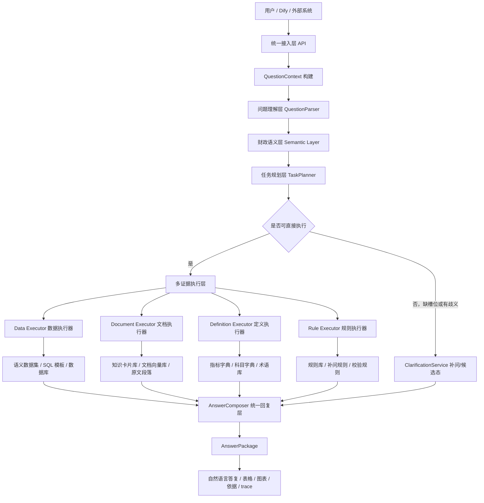
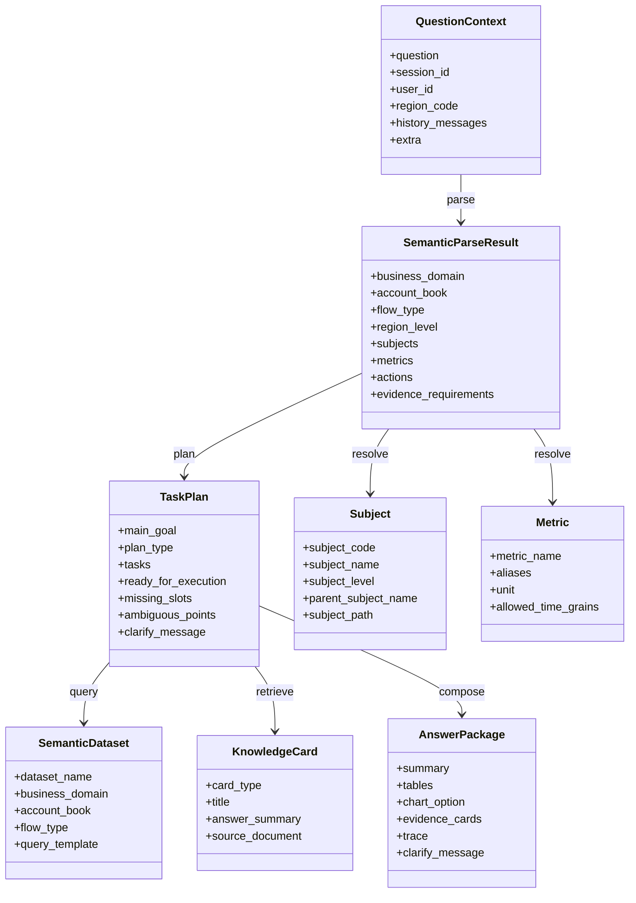

# 财政智能助手架构设计方案

## 1. 文档目的

本文档用于说明财政智能助手新架构的设计思路。  
本文档只描述**项目架构**，重点从业务视角和架构视角说明系统应该如何建设。

本文档重点说明以下内容：

1. 财政智能助手为什么要采用新的架构方式。
2. 新架构的核心设计原则是什么。
3. 新架构的整体分层、核心对象和运行流程是什么。
4. 新架构分阶段如何落地，每个阶段解决什么业务问题、优点是什么。

---

## 2. 建设背景

### 2.1 财政业务问题的特点

财政智能助手面对的不是普通通用问答场景，而是一个强业务约束场景。  
用户提出的问题通常具有以下特点：

1. 同时包含数据查询和业务解释需求。
2. 同时依赖结构化数据、制度文件、预算报告、口径规则。
3. 对科目层级、四本账、收支方向、地区层级、时间粒度非常敏感。
4. 对结果正确性、口径一致性、可解释性要求高。
5. 结果往往需要用于汇报、分析、审计或业务研判。

例如，下面几类问题都属于典型财政问题：

1. `预算执行业务域中，查询2025年全年省本级卫生健康支出的每月执行金额各是多少`
2. `2019年全省一般公共预算收入总计多少，由哪几部分构成`
3. `超长期国债属于什么口径，在哪些一级科目下会出现`
4. `为什么这个指标和去年的统计口径不同`

这些问题的共同点是：  
用户关注的是**财政业务结论**，而不是系统内部到底走了问答链路还是问数链路。

### 2.2 新架构需要解决的核心问题

新架构需要解决以下几类问题：

1. 如何让系统先理解财政业务问题，再决定调用哪些能力。
2. 如何让同一个问题同时使用数据、文档、定义和规则。
3. 如何处理缺槽位、歧义槽位和候选态问题。
4. 如何保证查询结果、文档解释和财政口径之间的一致性。
5. 如何支撑业务域、科目、指标、表规模和文档规模持续扩展。

### 2.3 新架构的总体目标

新架构的总体目标不是简单把多个能力拼接到一起，而是建设一个：

1. 统一入口的财政智能助手。
2. 以财政语义为核心的理解系统。
3. 可同时处理查数、解释、构成、依据、口径问题的统一系统。
4. 可持续扩展、可审计、可运营的长期架构。

---

## 3. 新架构设计原则

这一部分是整个方案的核心。  
后续的架构分层、核心对象、任务规划、补问机制、图表输出和管理平台，都是围绕这些原则展开的。

## 3.1 原则一：统一问题入口，统一问题模型

### 设计原因

财政智能助手面向的用户并不会区分自己提出的是“问答问题”还是“问数问题”。  
用户只会提出一个业务问题，而系统需要自己判断应该如何理解、如何规划、如何执行。

如果系统内部没有统一的问题入口和统一的问题模型，就会出现以下问题：

1. 不同能力模块各自维护自己的问题对象。
2. 同样的会话上下文在不同模块中处理方式不同。
3. 地区、时间、历史上下文在不同链路中重复解析。
4. 前端、工作流、日志系统看到的对象结构不一致。

### 解决的业务问题

统一问题入口和统一问题模型，主要解决以下问题：

1. 让所有问题先被标准化，再进入后续处理流程。
2. 让系统先站在统一视角理解问题，而不是先分派模块。
3. 让多轮对话中的上下文可以被稳定继承。
4. 让不同证据执行器都基于同一份问题上下文工作。

### 设计优点

1. 外部接入统一。
2. 内部问题对象统一。
3. 系统可追踪、可回放、可审计。
4. 后续新增能力时不需要重新定义一套输入对象。

### 财政业务示例

问题：
`2019年全省一般公共预算收入总计多少，由哪几部分构成`

在统一问题模型下，这个问题不会被一上来粗暴判断成“问答”或“问数”，而是先统一进入问题理解层，识别出：

1. 时间：2019年
2. 地区：全省
3. 四本账：一般公共预算
4. 对象：收入
5. 动作一：查总量
6. 动作二：解释构成

这样后续系统才能知道这个问题实际上需要多种证据。

---

## 3.2 原则二：先财政语义，后执行技术

### 设计原因

财政智能助手最难的部分不是“会不会写 SQL”或者“会不会检索文档”，而是“是否真正理解财政业务语义”。

财政语义至少包括：

1. 业务域
2. 四本账
3. 收支方向
4. 地区层级
5. 科目树
6. 指标定义
7. 时间粒度
8. 政策依据
9. 财政口径

如果没有独立的财政语义层，那么这些信息就会散落在：

1. prompt 中
2. SQL 规则中
3. 文档描述中
4. 若干硬编码逻辑中

久而久之，系统会变得很难维护。

### 解决的业务问题

这一原则主要解决以下问题：

1. 同一个科目在不同业务域下的含义不一致。
2. 同一个指标在不同口径下定义不同。
3. 文档解释和数据查询之间缺少统一的业务语义。
4. 扩表之后，系统越来越依赖隐式经验而不是显式定义。

### 设计优点

1. 语义定义稳定。
2. 问题理解更可控。
3. 数据查询、文档问答和规则判断能基于同一套财政概念工作。
4. 更适合后续建设规则引擎和管理平台。

### 财政业务示例

问题：
`超长期国债情况怎么样`

如果没有财政语义层，系统可能只把“超长期国债”当成普通关键字。  
但在财政语义层中，系统会知道：

1. 这是一个科目名称，不一定唯一。
2. 它可能出现在不同上级科目路径下。
3. 它可能与特定四本账、收支方向、业务域绑定。
4. “情况怎么样”不是一个明确指标。

这意味着系统会先进入财政语义判断，再决定是否补问，而不是直接误查。

---

## 3.3 原则三：从“选表”升级为“选语义数据集”

### 设计原因

传统问数系统很容易把重点放在“从很多表中选出最合适的一张表”。  
这种思路在表数量较少时还能工作，但随着财政业务扩展，会出现明显问题：

1. 表越来越多。
2. 同类业务表越来越多。
3. 表名和业务概念并不一致。
4. 用户根本不关心表，只关心业务对象。

因此，新架构不应该让上层问题直接面对底层物理表，而应该先面对“语义数据集”。

语义数据集的本质是：
把一个稳定的财政业务查询场景，抽象成一个业务数据对象。

### 解决的业务问题

这一原则主要解决：

1. 多表竞争导致的误选表问题。
2. 表结构变更对上层业务理解的冲击。
3. SQL 完全自由生成导致的稳定性问题。
4. 财政用户说的是业务概念，系统却只能理解物理表名的问题。

### 设计优点

1. 查询对象更贴近财政业务。
2. 更适合模板化查询。
3. 更适合配置化维护。
4. 后续扩表扩业务域时更稳定。

### 财政业务示例

问题：
`预算执行业务域中，查询2025年全年省本级卫生健康支出的每月执行金额各是多少`

在新架构里，系统优先命中的不是一张物理表，而是一个类似下面的语义数据集：

`预算执行月度省本级支出数据集`

系统会进一步知道：

1. 这是预算执行场景。
2. 这是支出方向。
3. 这是月度粒度。
4. 这是省本级层级。
5. 适合趋势类图表。

这样查询路径比“全表竞争”更稳定。

---

## 3.4 原则四：从“文档切片检索”升级为“知识卡片 + 原文双层检索”

### 设计原因

财政文档问答中，有很多问题不是简单要找一段原文，而是要找一个稳定的结论，例如：

1. 某项收入由哪几部分构成。
2. 某项支出的定义是什么。
3. 某个指标的统计口径是什么。
4. 某个结论依据哪份制度文件。

如果只做原始文档切片检索，就容易出现以下问题：

1. 召回结果分散。
2. 相关内容落在多个段落中。
3. 模型需要自己现场拼接答案。
4. 回答稳定性差。

因此，新架构建议在文档原文之外，再建设一层“财政知识卡片”。

### 解决的业务问题

这一原则主要解决：

1. 解释类问题回答不稳定。
2. 构成类问题很难从原文碎片里直接抽出标准答案。
3. 依据类问题往往需要同时给结论和出处。

### 设计优点

1. 问答结果更稳定。
2. 更容易形成标准化财政答复。
3. 更适合人工审核和知识运营。
4. 原文仍然保留，可用于补充证据。

### 财政业务示例

问题：
`2019年全省一般公共预算收入由哪几部分构成`

新架构下，系统可以优先检索“构成说明卡片”，快速得到稳定解释，再视需要补充原文出处。  
这样得到的是“先结论、后依据”的专业答复，而不是零散段落拼接。

---

## 3.5 原则五：允许候选态、补问态、执行态并存

### 设计原因

财政问题很多时候不是“能查”或“不能查”二选一，而是三种中间状态并存：

1. 信息完整，可以直接执行。
2. 意图明显，但条件不足，需要补问。
3. 语义接近可查，但存在歧义，需要候选确认。

如果系统没有中间状态，就会出现两个极端：

1. 条件不够时直接误查。
2. 稍有不完整就直接报错。

这两种都不适合财政业务场景。

### 解决的业务问题

这一原则主要解决：

1. 缺科目。
2. 缺指标。
3. 缺地区层级。
4. 科目歧义。
5. 指标歧义。

### 设计优点

1. 用户体验更自然。
2. 误查率更低。
3. 更适合多轮交互。
4. 更像专业业务助手，而不是死板查询工具。

### 财政业务示例

问题：
`查询2025年省本级超长期国债情况`

在新架构下，系统不会直接查，也不会简单回复“无法识别”，而是会判断：

1. 这是一个财政查询候选问题。
2. “超长期国债”可能存在多个上级科目路径。
3. “情况”不是明确指标。

于是系统进入补问态，提示用户补充：

1. 上级科目
2. 指标类型，例如金额、执行率、占比

---

## 3.6 原则六：统一回复必须同时面向用户和系统

### 设计原因

财政智能助手的输出不能只是一段自然语言。  
很多情况下，结果还需要：

1. 表格展示
2. 图表展示
3. 文档依据
4. 数据 trace
5. 补问提示
6. 工作流继续消费

因此，统一回复层既要面向用户，也要面向系统。

### 解决的业务问题

这一原则主要解决：

1. 前端展示结构不统一。
2. Dify 工作流节点难以复用结果。
3. 图表、摘要、依据和表格之间缺少一致结构。

### 设计优点

1. 同时适配页面展示和工作流处理。
2. 有利于结果复盘和审计。
3. 更适合长期产品化。

### 财政业务示例

当用户查询月度执行金额时，统一回复不应只返回“查到了 12 条记录”，而应统一输出：

1. 财政风格摘要
2. 数据表格
3. 图表配置
4. 查询依据说明
5. trace 信息

---

## 4. 新版总体架构图

下面给出新版财政智能助手的总体架构图。  
核心思想是：用户问题统一先进入财政语义层和任务规划层，再按需调用不同证据执行器。

### 4.1 保留总体架构图的原因

设计原因：
总体架构图有助于不同角色快速建立对系统的共同理解。

解决的业务问题：

1. 帮助业务人员理解系统如何处理一个问题。
2. 帮助研发人员理解分层职责。
3. 帮助评审人员快速把握方案完整性。

设计优点：

1. 沟通效率高。
2. 适合后续转 Word、PPT 或汇报材料。
3. 对新成员友好。

---

## 5. 核心对象设计

这一部分不从代码实现角度描述，而从架构对象角度描述系统内必须存在的核心对象。

## 5.1 QuestionContext

### 定位

`QuestionContext` 是统一问题上下文对象。  
它承接用户原始问题、地区上下文、会话上下文、来源渠道等信息。

### 设计原因

所有请求都应该先被标准化，否则后续解析、规划、执行和日志会出现边界不清的问题。

### 解决的业务问题

1. 同一问题在不同入口下保持一致表达。
2. 多轮对话上下文统一承接。
3. 支撑回放和审计。

### 设计优点

1. 输入统一。
2. 日志统一。
3. 问题链路可回放。

## 5.2 SemanticParseResult

### 定位

`SemanticParseResult` 是财政语义解析结果对象。  
它表示系统对一个问题在业务层面的理解结果。

### 设计原因

问题理解和问题执行必须拆开，否则“理解结果”和“执行计划”会混成一个对象。

### 解决的业务问题

1. 支撑业务域识别。
2. 支撑四本账识别。
3. 支撑科目、指标、时间、地区、动作识别。
4. 支撑证据需求判断。

### 设计优点

1. 语义层清晰。
2. 后续任务规划更稳定。
3. 复合问题更容易处理。

## 5.3 TaskPlan

### 定位

`TaskPlan` 是任务规划对象。  
它表示系统准备如何处理这个问题。

### 设计原因

统一智能助手面对的问题经常不是“一步完成”，而是需要拆成多个任务。

### 解决的业务问题

1. 同时查总量和查构成。
2. 同时查数据和查依据。
3. 同时判断补问与执行。

### 设计优点

1. 计划可视化。
2. 执行可追踪。
3. 复合问题天然支持。

## 5.4 Subject

### 定位

`Subject` 是财政科目对象。  
它不是简单字符串，而是带有编码、层级、路径、适用范围的业务对象。

### 设计原因

财政场景中的科目经常存在同名、多层级、多路径、多业务域适用的情况。

### 解决的业务问题

1. 同名二级科目歧义。
2. 科目路径补问。
3. 科目口径统一。

### 设计优点

1. 查数更准。
2. 解释更稳。
3. 歧义消解更自然。

## 5.5 Metric

### 定位

`Metric` 是财政指标对象。  
它承接指标名称、别名、单位、口径、适用范围等信息。

### 设计原因

用户很多说法不是标准指标，系统需要把自然语言表达映射成稳定指标对象。

### 解决的业务问题

1. 模糊指标识别。
2. 指标口径统一。
3. 图表和摘要的自动推荐。

### 设计优点

1. 指标解析更稳。
2. 问数更可控。
3. 图表和摘要更容易标准化。

## 5.6 SemanticDataset

### 定位

`SemanticDataset` 是语义数据集对象。  
它表示一个业务可理解的数据查询对象，而不是物理表。

### 设计原因

财政业务查询必须优先命中业务数据对象，而不是直接和物理表竞争。

### 解决的业务问题

1. 多表竞争。
2. 表名和业务概念不一致。
3. SQL 完全自由生成不稳定。

### 设计优点

1. 查询稳定。
2. 配置清晰。
3. 更适合业务维护。

## 5.7 KnowledgeCard

### 定位

`KnowledgeCard` 是知识卡片对象。  
它承接财政文档中稳定的定义、构成、依据、说明。

### 设计原因

很多解释类问题需要稳定答案，而不是依赖原文碎片现场拼接。

### 解决的业务问题

1. 构成类问题不稳定。
2. 依据类问题不稳定。
3. 术语解释不稳定。

### 设计优点

1. 答案稳定。
2. 便于审核。
3. 便于运营。

## 5.8 AnswerPackage

### 定位

`AnswerPackage` 是统一回复对象。  
它统一承接自然语言答复、表格、图表、依据、trace 和补问信息。

### 设计原因

统一智能助手的输出既要面向用户，也要面向系统。

### 解决的业务问题

1. 页面展示结构统一。
2. 工作流消费结构统一。
3. 结果留痕结构统一。

### 设计优点

1. 结果结构稳定。
2. 易于扩展。
3. 适合产品化。

---

## 6. 核心类关系图

### 6.1 保留类关系图的原因

设计原因：
对象边界是统一智能助手最容易混乱的部分之一。

解决的业务问题：

1. 帮助团队明确每个对象处于哪一层。
2. 帮助团队理解理解层、规划层、执行层、输出层的对象关系。

设计优点：

1. 对象职责边界更清楚。
2. 便于架构评审。
3. 便于后续形成实现标准。

---

## 7. 分阶段落地建议

这一部分从架构实施角度说明分阶段如何推进，不展开具体代码实现。

## 7.1 第一阶段：统一模型层与统一编排入口

### 设计原因

系统要先有稳定外壳，后续所有能力才能在同一承载层上建设。

### 解决的业务问题

1. 输入结构不统一。
2. 输出结构不统一。
3. 不同链路缺少统一编排入口。

### 设计优点

1. 建设风险低。
2. 见效快。
3. 为后续阶段打基础。

## 7.2 第二阶段：建设财政语义层

### 设计原因

财政语义层是统一智能助手真正的业务基础层。

### 解决的业务问题

1. 科目定义不统一。
2. 指标定义不统一。
3. 业务域边界不清。
4. 规则口径难沉淀。

### 设计优点

1. 上层理解稳定。
2. 下层执行稳定。
3. 为数据集、知识卡片、规则引擎打基础。

## 7.3 第三阶段：建设语义数据集模式

### 设计原因

查数能力要从“表驱动”升级为“业务对象驱动”。

### 解决的业务问题

1. 表太多导致竞争复杂。
2. 表结构变更冲击上层逻辑。
3. SQL 完全自由生成不稳定。

### 设计优点

1. 查询路径稳定。
2. 更贴近财政业务。
3. 更容易控制口径。

## 7.4 第四阶段：建设知识卡片模式

### 设计原因

解释类问题需要稳定的知识表达层。

### 解决的业务问题

1. 文档问答波动大。
2. 构成和依据类问题难以稳定回答。
3. 知识无法标准化运营。

### 设计优点

1. 解释结果更稳定。
2. 依据更清晰。
3. 更适合知识积累。

## 7.5 第五阶段：建设规则引擎与补问机制

### 设计原因

财政问题存在大量“接近可查，但条件不足”的场景。

### 解决的业务问题

1. 缺槽位问题。
2. 歧义科目问题。
3. 歧义指标问题。
4. 候选确认问题。

### 设计优点

1. 降低误查率。
2. 提升用户体验。
3. 更适合多轮交互。

## 7.6 第六阶段：统一图表、摘要和证据输出

### 设计原因

统一智能助手的结果必须同时满足展示、分析和系统消费需求。

### 解决的业务问题

1. 图表、表格、摘要、依据之间结构不统一。
2. 工作流消费结果不稳定。
3. 用户结果不完整。

### 设计优点

1. 展示更完整。
2. 复用性更强。
3. 可审计性更强。

## 7.7 第七阶段：建设管理平台与构建任务中心

### 设计原因

长期来看，财政智能助手必须可运营、可维护、可治理。

### 解决的业务问题

1. 新增数据集难维护。
2. 新增文档难导入。
3. 新增规则难维护。
4. 向量和知识构建缺少统一任务中心。

### 设计优点

1. 业务和技术可协同维护。
2. 持续运营能力强。
3. 系统可持续演进。

---

## 8. 分阶段路线图

### 8.1 为什么路线图要这样安排

设计原因：
如果一开始就试图同时完成全部建设内容，项目风险过高。

解决的业务问题：

1. 保证每个阶段都能独立交付。
2. 保证每个阶段都能带来明确业务收益。
3. 保证系统能边建设边验证。

设计优点：

1. 风险可控。
2. 节奏清晰。
3. 更适合财政项目长期推进。

---

## 9. 总结

财政智能助手新架构的核心，不是把“问答”和“问数”拼得更紧，而是：

1. 建立统一入口。
2. 建立统一财政语义层。
3. 建立统一任务规划层。
4. 建立多证据执行层。
5. 建立统一回复层。
6. 建立可持续运营的管理与治理能力。

这套架构最适合财政业务场景的原因在于：

1. 它面向的是财政业务问题，而不是技术模块。
2. 它能同时处理查数、解释、依据和口径问题。
3. 它更适合多业务域、多表、多文档持续扩展。
4. 它更容易保证财政口径一致性和结果可解释性。

