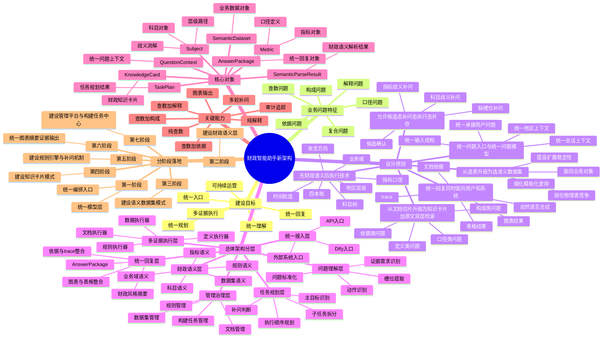

# 财政智能助手核心设计框架思维导图

下面是基于《财政智能助手架构设计方案》整理的核心设计框架思维导图。  
如果你的 Markdown 查看器支持 Mermaid，可以直接渲染为思维导图。

## 导图阅读建议

1. 先看“建设目标”和“设计原则”，理解为什么财政智能助手不能只按问答或问数拆分。
2. 再看“总体架构分层”，理解系统从接入到最终回复的整体链路。
3. 然后看“核心对象”和“关键能力”，理解系统为什么能支撑复合财政问题。
4. 最后看“分阶段落地”，理解这套架构如何逐步实施。

